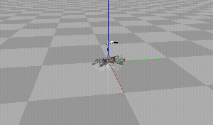
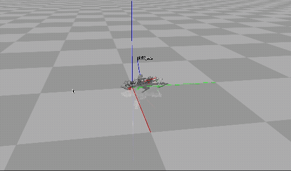
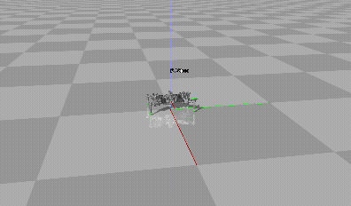

# 🤖 MuJoCo Snapbot 실습 (Forward / Vertical / Sidewalk)

이 프로젝트는 **MuJoCo 시뮬레이터**에서 강화학습 알고리즘인 **Soft Actor-Critic (SAC)**을 적용하여 Snapbot이 다양한 행동(전방 점프, 수직 점프, 사이드워킹)을 학습하는 과정을 포함합니다.

---

## 🛠️ 환경 구성 (Conda)

```bash
conda create -n snapbot_env python=3.10
conda activate snapbot_env
pip install -r requirements.txt
```

> MuJoCo 및 `mujoco_py`, `torch`, `matplotlib`, `imageio` 등 필요 패키지를 포함합니다.

---

## 📁 디렉토리 구성 및 실행 방법

```
rl_snapbot/
├── package/gym/
│   ├── forward/            # 전방 점프 실험 환경
│   ├── vertical/           # 수직 점프 실험 환경
│   └── sidewalk/           # 사이드워킹 실험 환경
├── package/gym/snapbot_env.py  # 보상 함수 정의 위치
├── notebook/result/
│   ├── forward/episode_1000.pth
│   ├── vertical/episode_900.pth
│   └── sidewalk/episode_750.pth
├── notebook/snapbot_train.ipynb     # SAC 학습 노트북
├── notebook/snapbot_eval.ipynb      # 학습된 모델 실행 노트북
└── README.md
```

### ▶️ 직접 학습 실행

1. `package/gym/snapbot_env.py` 내에서 보상 함수 수정  
2. `snapbot_train.ipynb` 실행 → `notebook/result/weights/sac_snapbot/`에 결과 저장

### ▶️ 저장된 모델 실행

`snapbot_eval.ipynb`에서 task를 선택 후 실행:

```python
task = 'forward'  # or 'vertical', 'sidewalk'
```

> 자동으로 `result/{task}/episode_{n}.pth` 모델을 불러 실행합니다.

---

## 🧠 보상 함수 설계

### 🔹 Forward Jump

```python
z_velocity = (p_torso_curr[2] - p_torso_prev[2]) / self.dt
x_diff = p_torso_curr[0] - p_torso_prev[0]
is_jumping = z_velocity > 0.0
r_jump = 200.0 * x_diff if is_jumping else 10.0 * x_diff
r_lane = -np.abs(p_torso_curr[1]) * 0.5
r_heading = 0.01 * np.dot(R_torso_curr[:, 0], np.array([1, 0, 0]))
if r_heading < 0: r_heading *= 100.0
```  
- **점프 중 멀리 갈수록 보상 증가**
- **y축으로 벗어나면 감점**
- **정면 방향을 유지하면 보상, 반대 방향은 강한 패널티**
- **자기 충돌 시 감점, 자세 유지 실패 시 종료**  

```python
r = r_jump + r_lane + r_heading + r_collision + r_survive
```

---

### 🔹 Vertical Jump

```python
z_velocity = (z_curr - z_prev) / self.dt
r_velocity = max(z_velocity, 0.0) * 10.0
x_diff = x_curr - x_prev
y_diff = y_curr - y_prev
r_drift = -(x_diff + y_diff) * 10.0
r = r_velocity + r_drift + r_collision + r_survive
```  
- **수직 속도가 빠를수록 보상**
- **수평 방향으로 새는 움직임에 대해 감점**
- **자기 충돌 및 자세 유지 실패 시 감점 또는 종료**  

```python
r = r_vertical + r_collision + r_survive
```

---

### 🔹 Sidewalk Navigation

```python
if not at_target:
    r_sidewalk = 0.0
    r_sidewalk += (abs(x_diff) if x_toward else -abs(x_diff)) / self.dt
    r_sidewalk += (abs(y_diff) if y_toward else -abs(y_diff)) / self.dt
else:
    r_sidewalk = 20.0
    if drift > 1e-3: r_sidewalk -= drift * 100.0
r_slow_down = -speed * 2.0 if distance_to_target < 0.5 else 0.0
r_heading = 0.01 * np.dot(heading_vec, target_direction_perp)
r_heading = r_heading * 2.0 if r_heading > 0 else r_heading * 100.0
r = r_sidewalk + r_slow_down + r_heading + r_collision + r_survive
```  
- **목표 지점(2.0, -3.0)까지 도달하면 보너스**
- **목표 도달 이후 이동하면 감점**
- **목표 가까이일수록 속도를 줄이는 유도**
- **목표 방향의 수직 방향을 바라보는 헤딩 유지 유도**
- **자기 충돌 강한 패널티**  

```python
r = r_sidewalk + r_slow_down + r_heading + r_collision + r_survive
```

---

## 🎞️ 실험 결과 (GIF)

| Task        | Animation |
|-------------|-----------|
| Forward Jump |  |
| Vertical Jump |  |
| Sidewalk Walk |  |

> 각 Task별 Snapbot의 학습 결과를 시각적으로 확인할 수 있습니다.

---

## 📌 참고 사항

- 보상 함수는 환경별로 `snapbot_env.py`에서 정의됨
- 학습은 Soft Actor-Critic 알고리즘 기반
- `rollover`, self-collision 등을 통한 안정성 고려 포함

---

## 👨‍🔬 실험 목적

- 다양한 보상 설계를 통해 로봇의 점프/이동 행동 유도
- 행동별 보상 효과 비교 및 시각적 검증
- 강화학습 기반 물리 시뮬레이션 실습 경험 축적

